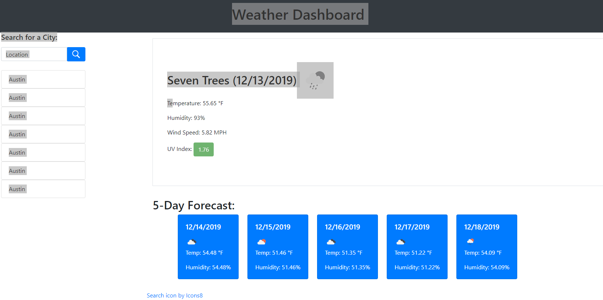
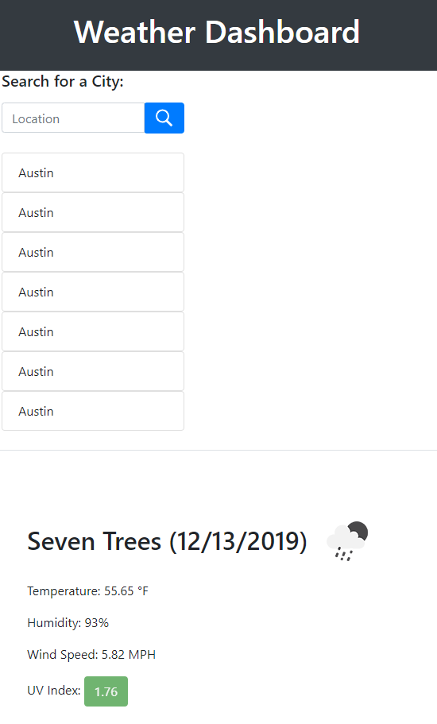

# Weather Dashboard

This is the repository of a web application that displays the weather and the forecast for a given city.

## Code for retrieving the current weather info.
```javascript
    /*
    * getWeather 
    * 
    * @param{string} query { q: location } or { lat: latitude, lon: longitude }
    * @return{Promise} which resolves to:
    * {
    *     city: String,
    *     date: moment().format("M/D/YYYY"),
    *     temperature: Number,
    *     humidity: Number,
    *     wind_speed: Number,
    *     icon_url: String,
    *     latitude: Number,
    *     longitude: Number
    * }
    */
    getWeather: function (queryObject) {
        return get(queryObject, "weather").then((response) => {
            if (response.cod && response.cod !== 200) {
                console.log("COD!!!")
                return {}
            }            
            return new Promise((resolve) => resolve({
                city: response.name,
                date: moment(parseInt(response.dt) * 1000).format("M/D/YYYY"),
                temperature: response.main.temp,
                humidity: response.main.humidity,
                wind_speed: response.wind.speed,
                icon_url: "https://openweathermap.org/img/wn/" +
                    response.weather[0].icon + "@2x.png",
                latitude: response.coord.lat,
                longitude: response.coord.lon
            }))
        });
    }
    /*
    * getUVI
    * 
    * @param{string} query { lat: latitude, lon: longitude }
    * @return{Promise} which resolves to:
    * {
    *     uv_index: Number
    * }
    */
    getUVI: function (latitude, longitude) {
        return get({ lat: latitude, lon: longitude }, "uvi").then((response) =>
            new Promise((resolve) => resolve({ uv_index: response.value }))
        );
    },
    /*
    * getForecast
    * 
    * @param{string} query { lat: latitude, lon: longitude }
    * @return{Promise} which resolves to:
    * {
    *     forecast: [
    *         city: String,
    *         date: String("M/D/YYYY"),
    *         icon_url: String,
    *         temperature: Number,
    *         humidity: Number
    *     ]
    * }
    */
    getForecast: function (latitude, longitude) {
        return get({ lat: latitude, lon: longitude, exclude: "minutely,hourly,current,alerts" }, "onecall").then((response) =>
            new Promise((resolve) => resolve({
                forecast: response.daily.slice(1, 6).map((value, i) => {
                    return {
                        city: response.name,
                        date: moment(parseInt(response.daily[i].dt) * 1000).format("M/D/YYYY"),
                        icon_url:
                            "https://openweathermap.org/img/wn/" +
                            response.daily[i].weather[0].icon +
                            "@2x.png",
                        temperature: response.daily[i].temp.day,
                        humidity: response.daily[i].humidity,
                    }
                })
            }))
        );
    }
```
## Image example of the web page:




## Getting Started

These instructions will get you a copy of the project up and running on your local machine for development and testing purposes. See deployment for notes on how to deploy the project on a live system.

### Prerequisites

Git, SVN, Git Desktop or Microsoft Visual Studio or some disk drive
space to unzip the contents of the repository.

### Installing

1) Visit https://github.com/redmarmaduke/weather-dashboard.
2) Select the Clone or Download button
3) Select the most appropriate format/method for download. 
```
ex. using the command line git tool

git clone https://github.com/redmarmaduke/weather-dashboard.git

```

4) Open up the index.html file present in your favorite browser.

## Built With

* [HTML](https://developer.mozilla.org/en-US/docs/Web/HTML)
* [CSS](https://developer.mozilla.org/en-US/docs/Web/CSS)
* [JS](https://developer.mozilla.org/en-US/docs/Web/JavaScript)
* [Moment.js](https://momentjs.com/docs/)
* [Bootstrap](https://getbootstrap.com/docs/4.4/)
* [React](https://reactjs.org/docs/)

## Deployed Link

* [See Live Site](https://redmarmaduke.github.io/weather-dashboard/)

## Authors

* **Manuel Nunes** 

- [Link to Portfolio Site](https://portfoleieio.herokuapp.com/)
- [Link to Github](https://github.com/redmarmaduke/)
- [Link to LinkedIn](https://www.linkedin.com/in/manuel-nunes-272ba31b/)

See also the list of [contributors](https://redmarmaduke.github.io/weather-dashboard/CONTRIBUTING) who participated in this project.

## License

This project is licensed under the MIT License

## Acknowledgments

* [Icon8.com Images](https://img.icons8.com/)